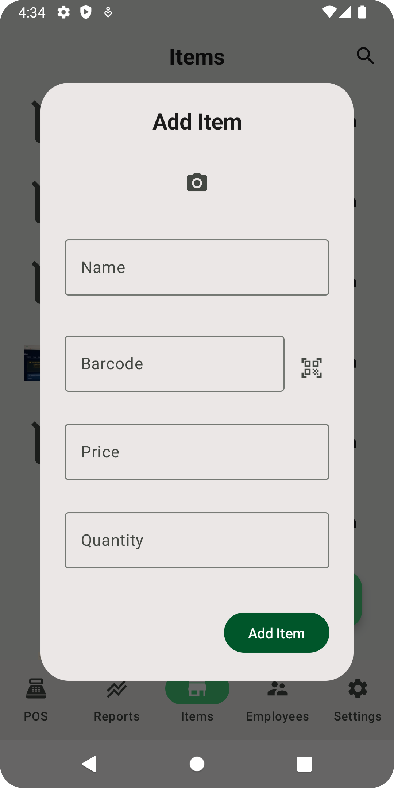

# Point-of-Sale (POS) App

## Overview

The **Point-of-Sale (POS) App** is designed to simplify and streamline sales transactions for
businesses. It functions as a digital cash register, enabling businesses to accept payments, manage
inventory, and generate sales reports. The app focuses on usability, security, and efficiency,
providing an excellent experience for both customers and business owners.

## Key Features

- **Sales Management**: Process sales, accept multiple payment methods, and print receipts.
- **Inventory Management**: Track stock levels, add new products, and receive low-stock
  notifications.
- **Cloud Sync**: Synchronize sales and inventory data in real-time across devices.
- **Secure Authentication**: Protect user accounts with Firebase Authentication.
- **Offline Support**: Operate seamlessly offline; the app syncs data when back online.
- **Multi-language Support**: Supports English and Arabic for localized transactions.

## Technology Stack

| **Feature**             | **Technology**          | **Description**                                                |
|-------------------------|-------------------------|----------------------------------------------------------------|
| Programming Language    | Kotlin                  | Modern, concise, and feature-rich for Android development.     |
| Dependency Injection    | Dagger Hilt             | Ensures compile-time safe dependency management.               |
| Asynchronous Operations | Kotlin Coroutines       | Manages async programming and enhances app responsiveness.     |
| Local Storage           | Datastore-proto         | Persistent storage for offline user data.                      |
| Cloud Storage           | Firebase Firestore      | Real-time cloud database for data storage and synchronization. |
| Authentication          | Firebase Authentication | Secure user login and account management.                      |
| Image Storage           | Firebase Storage        | Handles cloud storage for images and media files.              |
| Testing                 | JUnit, MockK, Espresso  | Testing frameworks for unit, mock, and UI testing.             |

## Architecture and Project Structure

The app follows a **modular architecture** designed for scalability and maintainability, with clear
separation between the core functionality and specific features.

| **Module**              | **Description**                                                                         |
|-------------------------|-----------------------------------------------------------------------------------------|
| `build-logic`           | Defines project-specific conventions and plugins, maintaining configurations centrally. |
| `app`                   | Main application logic resides here, integrating all the features and UI components.    |
| `feature`               | Contains screens and functionality that are modularized as features.                    |
| `core`                  | Reusable modules providing utilities and core business logic.                           |
| `ui-test-hilt-manifest` | Used for testing UI components with Hilt for dependency injection.                      |

## Use Cases

### 1. **Business Owner**

A business owner logs in to manage their store's daily transactions, view sales reports, and update
product inventory.

- **Login**: The owner securely logs in using Firebase Authentication.
- **Inventory Updates**: Add, remove, or update product details in the inventory.
- **Sales Reporting**: View reports showing total sales, top-selling products, and transaction
  history.

### 2. **Cashier**

The cashier uses the POS system to handle customer purchases and print receipts during checkout.

- **Process Sales**: Scan product barcodes or select products from the menu to process sales.
- **Payments**: Accept payments via cash, card, or digital payment methods.
- **Print Receipts**: Print a receipt for the customer after completing the transaction.

## Screenshots

### **Business Owner**

*Home Screen*  

*Inventory Management*  

*Profile*

*Reports*

*Setting*

### ** Cashier**

## Modularization

The project uses a modular approach to structure the app, ensuring flexibility and ease of
maintenance.

- **App Module**: Main entry point of the application.
- **Feature Module**: Encapsulates all the features, such as `sales`, `inventory`, and `reports`.
- **Core Module**: Contains utilities, models, and other shared components.

## Testing

We follow a **Test-Driven Development (TDD)** approach and ensure robust testing coverage using the
following frameworks:

- **Unit Testing**: JUnit and MockK for testing core business logic.
- **UI Testing**: Espresso for testing user interface and interaction.
- **Integration Testing**: Conducted across features to ensure the app's overall stability.

## Download APK

You can download the latest APK from the [GitHub Actions](https://github.com/Case-Code/POS/actions)
page.
Simply download and install the APK on your Android device to get started.
